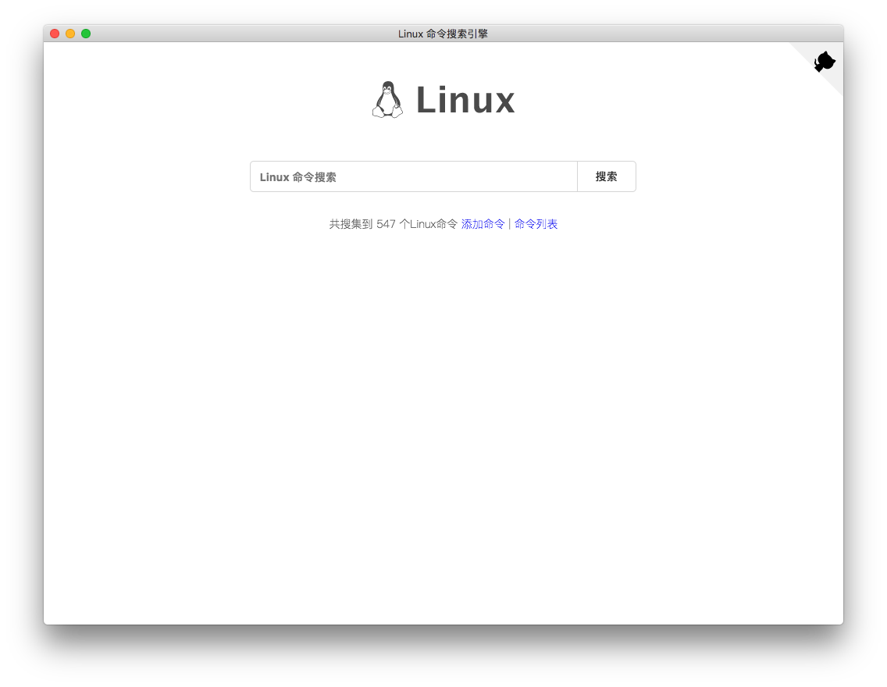

Linux Command 桌面版 
=========================================================================================

 

## Linux Command 最新桌面版下载

- [Mac](https://github.com/haloislet/linux-command/releases/download/v2.0.0/linux-command-1.1.0.dmg)
- [Win](https://github.com/haloislet/linux-command/releases/download/v2.0.0/linux-command.Setup.1.1.0.exe)
- [Linux](https://github.com/haloislet/linux-command/releases/download/v2.0.0/linux-command-1.1.0-x86_64.AppImage)

 

## 说明
基于 [jaywcjlove/linux-command](https://github.com/jaywcjlove/linux-command) web 版本制作的桌面版应用。

感谢 [jaywcjlove](https://github.com/jaywcjlove)

欢迎 PR

 

## 许可证

The MIT License (MIT)
